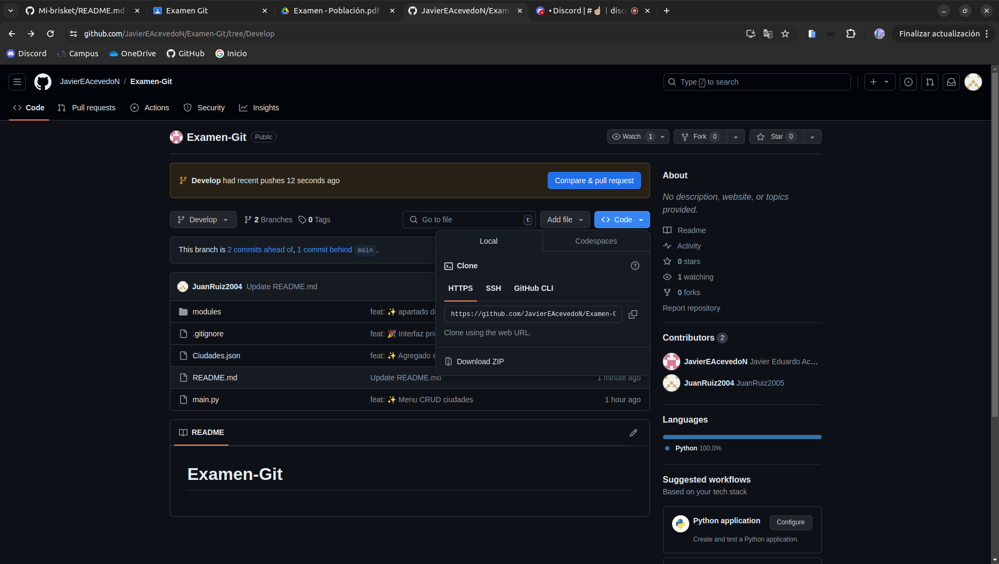
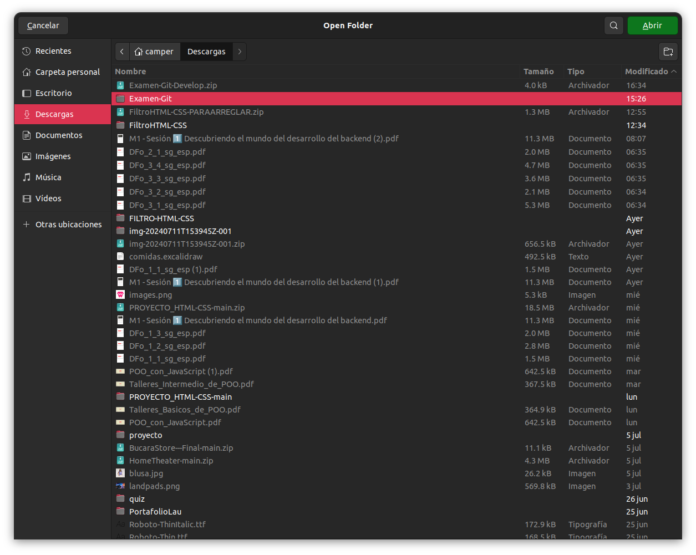
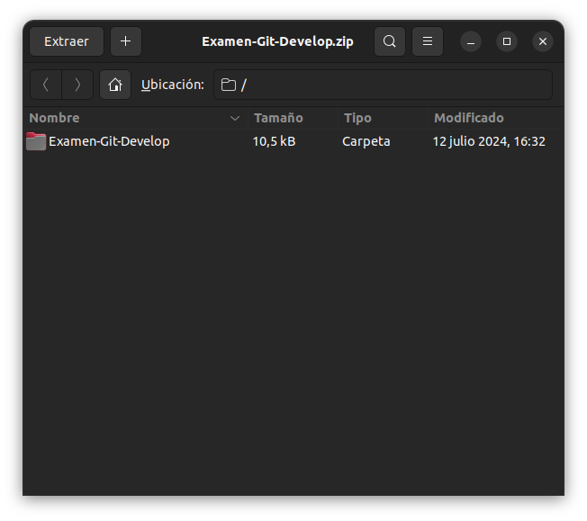
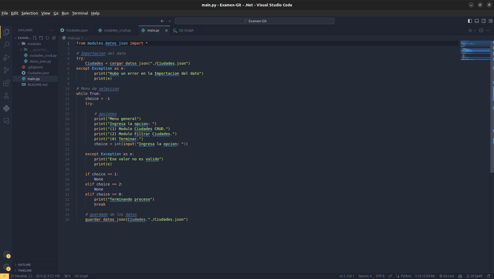
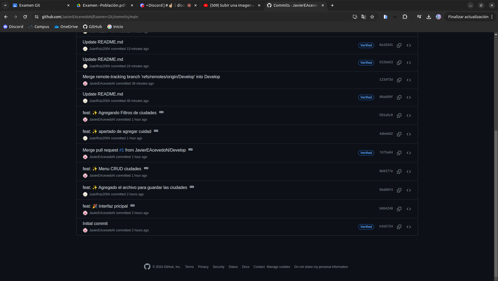
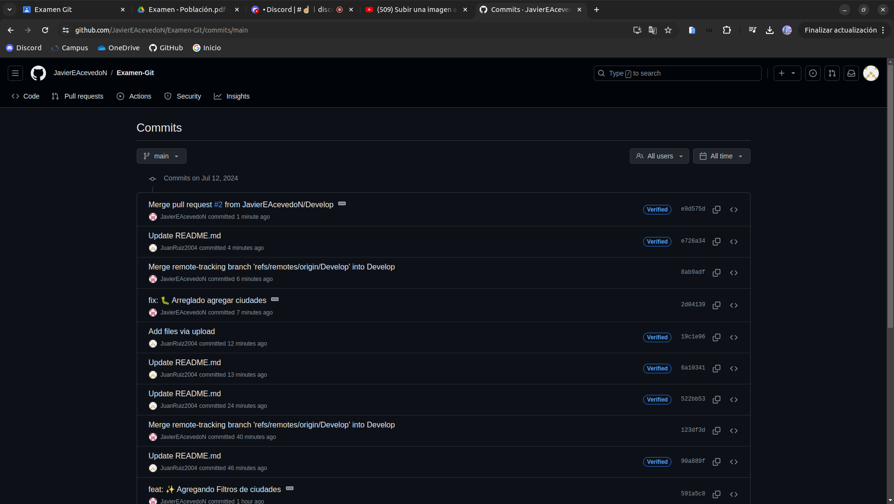
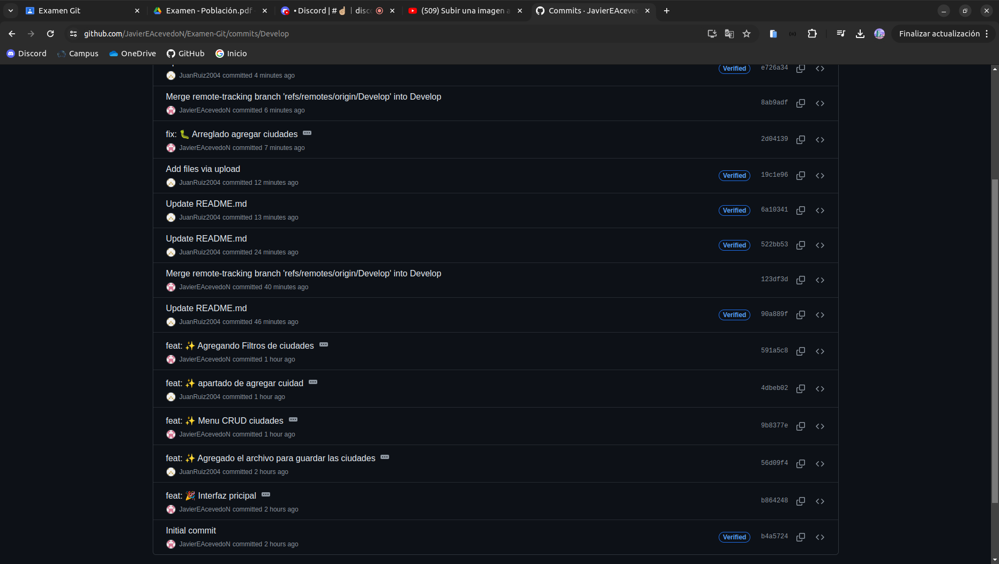
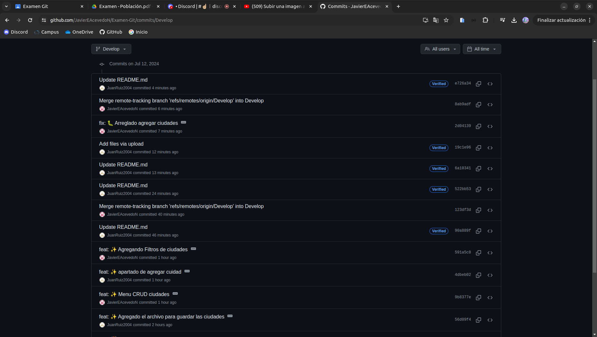

# Examen Git -ciudades- Skyfall 🙈😎

## Descripción🤯
Este es el examen de Git, en el cual se tratara de aplicar la rubricas aprendidas en clase y poniendo a prueba nuestros conocimiento de Python
---
## Tabla de contenido💼📝📁
 - [General de python](#general-python)
 - [General Git](#general-git)
 - [¿Que se hizo?](#que_se_hizo)
 - [Como instalarlo](#instalacion)
 - [Como Usarlo](#uso)
 - [Commits](#apartado_de_commits)
 - [Construido con](#herramienta)
 - [Autores](#autores)
   
<h2 id="general-python">General-Python🔩🪛:</h2>

***Registro y Gestión de ciudades: 🇨🇴🇦🇷***

- Opciones para agregar y modificar ciudades
- Opcion para Mostrar las ciudades que ya estan agregadas en el archivo json
- Funciones de busqueda avanzada
- Exportacion de datos
  
<h2 id="general-git">General-Git🖇️:</h2>

- Utilizar ramas para poder manejar el proyecto mas "eficientemente"
- Utilizar el "merge" para la unificacion de las ramas
- Utilizar continuamente o cuando se requiera elk comando "commit"
- Solucionar problemas que se vean afectados por la unificacion de ramas

<h2 id="que_se_hizo">¿Que se hizo?:</h2>

- 1). Lo primero que hicimos fue separar los roles de cada uno
- 2). En el momento que teniamos algun cambio significativo terminado haciamos un commit
- 3). En un momento hubo una creacion de una rama en la cual comenzamos a ver que seria del proyecto si se hiciera tal cambio
- 4). Si ese apartado funcionaba le haciamos merge para unir las partes
- 5). Ocurrio un problema al hacer merge, entonces el visual estudio abrio un apartado para poder solucionarlo y agregar las 2 ramas
- 6). Hicimos commit del trabajo realizado y se subio al github
- (NOTA) Cada commit de git, se le hizo su debida descripcion y por quien fue hecho el cambio

<h2 id="instalacion">Instalacion🛐🛐:</h2>

- Lo primero que se debe de hacer es descargar el archivo.zip.  
  
- Luego Buscar en la carpeta de archivos el archivo `Examen-Git`.  
  
- Luego lo que debemos de hacer es descomprimirlo para tener la carpeta completa con los archivos.  
  
- Ultimo lo abrimos con nuestro visual estudio code.  

<h2 id="uso">Uso🖐️🗿🫵:</h2>

- Luego de terminar con la instalacion lo que debemos de hacer es:
- Abrir el archivo con visual estudio code.
- Luego dentro de todos los archivos nos vamos a uno especifico que tiene como nombre "main.py"
- En este se desplegara un menu con todas las funcionalidades ya antes mencionadas

<h2 id="apartado_de_commits">Apartado de commits:</h2>

- En total se realiazron 19 commits en la rama de main, contanto a este

- En la rama de Develop el total de commits fueron 14:

<h2 id="herramienta">Herramienta🏹🪚⚱️:</h2>

- Python :3
- Git
- GitHub

<h2 id="autores">Autores🧏‍♂️🧏‍♂️:</h2>

* **Juan Ruiz:** [Juanruiz2004](https://github.com/JuanRuiz2004)
* **Javier Acevedo:** [JavierEAcevedoN](https://github.com/JavierEAcevedoN)